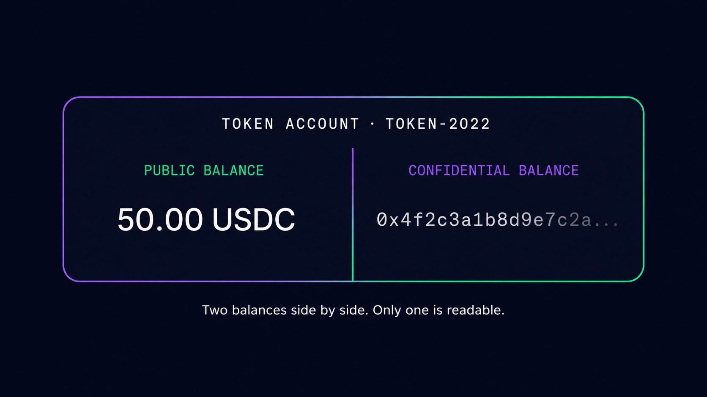
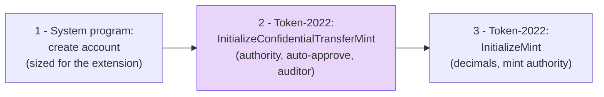

# Step 01 — Create a Confidential-Transfer Mint

## What happens in this step

We create a completely ordinary Token-2022 mint on devnet — with one addition: a `ConfidentialTransferMint` extension baked in at creation time. That single extension is the entire "opt-in" to confidential transfers. There is no separate privacy program to deploy and no special token standard: public balances, decimals, and the mint authority all keep working exactly as before, and the confidential machinery becomes *available* to any holder of this token. One transaction, three instructions, done.



Every account for this mint will be able to hold value in both worlds shown above — a public balance anyone can read, and encrypted balances only the owner can read. This step just unlocks the right-hand side.

## The mechanics

The extension must be initialized **before** the mint itself, because `InitializeMint` finalizes the account layout:



Three configuration choices worth saying out loud:

| Field | Our value | What it controls |
|---|---|---|
| `authority` | the payer | who can change this config later |
| `autoApproveNewAccounts` | `true` | anyone may configure a confidential account; set `false` for allowlist-style onboarding |
| `auditorElgamalPubkey` | `null` | if set, **every transfer amount is also encrypted to this key** — one designated party can decrypt amounts. Compliance without a public ledger. |

## The key code (from `01-create-mint.ts`)

```ts
const ctMintExtension = extension('ConfidentialTransferMint', {
  authority: payer.address,          // can update the CT config later
  autoApproveNewAccounts: true,      // no gatekeeping: anyone can opt in
  auditorElgamalPubkey: null,        // no auditor — amounts visible to NO third party
});
const space = BigInt(getMintSize([ctMintExtension]));

await executePlan(tools, nonDivisibleSequentialInstructionPlan([
  getCreateAccountInstruction({ payer, newAccount: mintSigner, lamports: rent, space, programAddress: TOKEN_2022_PROGRAM_ADDRESS }),
  getInitializeConfidentialTransferMintInstruction({ mint, authority: payer.address, autoApproveNewAccounts: true, auditorElgamalPubkey: null }),
  getInitializeMintInstruction({ mint, decimals: DECIMALS, mintAuthority: payer.address, freezeAuthority: null }),
]));
```

Run it:

```bash
NODE_OPTIONS=--experimental-wasm-modules npx tsx apps/web/scripts/workshop/01-create-mint.ts
```

Then open the printed mint address in the explorer and point at the `ConfidentialTransferMint` extension sitting next to ordinary mint data.

## Protocol internals

This is the exact struct our extension writes on-chain — [interface/src/extension/confidential_transfer/mod.rs](https://github.com/solana-program/token-2022/blob/main/interface/src/extension/confidential_transfer/mod.rs) in the Token-2022 repo:

```rust
pub struct ConfidentialTransferMint {
    /// Authority to modify the `ConfidentialTransferMint` configuration and to
    /// approve new accounts (if `auto_approve_new_accounts` is true)
    pub authority: MaybeNull<Address>,

    /// Indicate if newly configured accounts must be approved by the
    /// `authority` before they may be used by the user.
    pub auto_approve_new_accounts: Bool,

    /// Authority to decode any transfer amount in a confidential transfer.
    pub auditor_elgamal_pubkey: MaybeNull<PodElGamalPubkey>,
}
```

Note the doc comment on the auditor field: "Authority to decode **any** transfer amount." The full instruction processing lives in [program/src/extension/confidential_transfer/processor.rs](https://github.com/solana-program/token-2022/blob/main/program/src/extension/confidential_transfer/processor.rs).

## What to say if asked

**"Can I add confidential transfers to my existing token?"**
No — mint extensions must be set at creation, because they change the mint account's size and layout. You'd launch a new Token-2022 mint (or a wrapped version of your token) with the extension.

**"Does the auditor see who is transacting, or just amounts?"**
Sender and receiver token accounts are public on every transfer anyway — only the *amount* is encrypted. The auditor key lets that one party decrypt amounts too. What's confidential to the world is the amount; the graph of who-paid-whom is visible.

**"Is this live on mainnet?"**
The Token-2022 program with this extension is deployed on mainnet-beta, and the ZK ElGamal Proof program it relies on is enabled. Check current feature-gate status for your cluster before shipping.
