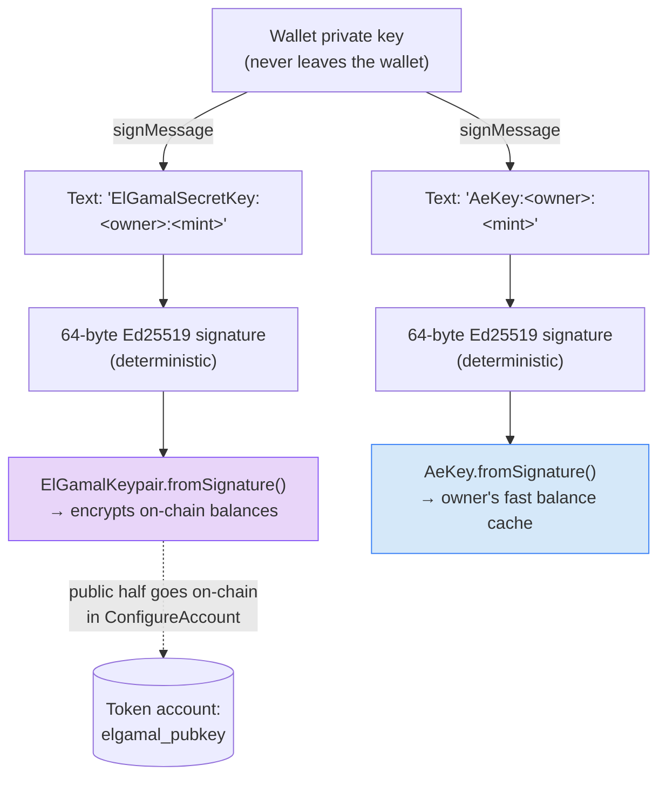

# Step 02 — Owners, Signature-Derived Keys, and Account Configuration

## What happens in this step

We create two fresh wallets — Alice and Bob — fund them with a little SOL, and give each a *confidential-ready* token account. The interesting part is where their encryption keys come from: nowhere. Each owner signs two short, human-readable messages with their ordinary wallet key, and the signatures are stretched into an ElGamal keypair (for the on-chain encrypted balances) and an AES key (for their private balance cache). Configuring the account then publishes the ElGamal *public* key into the token account on-chain — which is exactly what future senders will encrypt to, and exactly why a recipient must configure **before** anyone can send to them.

## Key derivation: signatures over readable text

This is the mechanic to spend time on. Nothing is generated randomly and nothing is stored — the keys are a pure function of (wallet, owner, mint):



Points to make while it's on screen:

- **Deterministic = re-derivable anywhere.** Sign the same text in this script, in the web app, on a new laptop — same keys come out. Lose your "ElGamal key"? You never had it stored; just sign again.
- **Why readable text?** Wallets like Phantom refuse to sign opaque binary blobs via `signMessage` (they can't show users what they're approving). Plain text is wallet-friendly and just as deterministic. This is the exact scheme the web app uses (`apps/web/src/lib/confidentialTransfer.ts`), so a wallet behaves identically in both.
- **Per owner AND per mint.** Different mints yield different keys — one compromised mint's keys reveal nothing about another's.

## Configuration also needs a proof


Your first taste of the ZK flow: the chain won't store an ElGamal pubkey unless you prove it's well-formed (that you actually hold a secret key for it — a malformed pubkey could make funds sent to you unspendable or violate protocol assumptions). Each account setup transaction bundles: create ATA → reallocate for the extension → configure → **verify pubkey-validity proof**.

## The key code (from `02-configure-account.ts`)

```ts
// helpers.ts — deriveCtKeys: matches the web app exactly
const elgamalKeypair = ElGamalKeypair.fromSignature(await signText(`ElGamalSecretKey:${signer.address}:${mint}`));
const aesKey = AeKey.fromSignature(await signText(`AeKey:${signer.address}:${mint}`));

// 02-configure-account.ts — one plan does ATA create + reallocate + configure + proof
await executePlan(tools, await getCreateConfidentialTransferAccountInstructionPlan({
  payer,
  owner: alice.signer,
  mint,
  rpc,
  elgamalKeypair: aliceKeys.elgamalKeypair,
  aesKey: aliceKeys.aesKey,
}));
```

Run it:

```bash
NODE_OPTIONS=--experimental-wasm-modules npx tsx apps/web/scripts/workshop/02-configure-account.ts
```

The script prints the literal message strings being signed — read one aloud. Then open a token account in the explorer and show the `ConfidentialTransferAccount` extension with its `elgamalPubkey` field.

## Protocol internals

`ConfigureAccount` processing — [program/src/extension/confidential_transfer/processor.rs](https://github.com/solana-program/token-2022/blob/main/program/src/extension/confidential_transfer/processor.rs), `process_configure_account`. The ElGamal pubkey is only accepted out of a *verified proof context*, then written into the account with zeroed balances:

```rust
let elgamal_pubkey = match elgamal_pubkey_source {
    ElGamalPubkeySource::ProofInstructionOffset(offset) => {
        // zero-knowledge proof certifies that the supplied ElGamal public key is valid
        let proof_context = verify_and_extract_context::<
            PubkeyValidityProofData,
            PubkeyValidityProofContext,
        >(account_info_iter, offset, None)?;
        proof_context.pubkey
    }
    ...
};
...
confidential_transfer_account.approved = confidential_transfer_mint.auto_approve_new_accounts;
confidential_transfer_account.elgamal_pubkey = elgamal_pubkey;
...
// The all-zero ciphertext [0; 64] is a valid encryption of zero
confidential_transfer_account.pending_balance_lo = EncryptedBalance::zeroed();
confidential_transfer_account.pending_balance_hi = EncryptedBalance::zeroed();
confidential_transfer_account.available_balance = EncryptedBalance::zeroed();
```

Two nice details in that snippet: `approved` is set straight from the mint's `auto_approve_new_accounts` (our step 01 choice landing here), and all-zero bytes are a *valid ElGamal encryption of zero* — fresh accounts start as legitimate ciphertext.

## What to say if asked

**"What if I lose my ElGamal key?"**
You can't lose it in any meaningful sense — it's re-derived from a wallet signature over deterministic text whenever needed. Losing the *wallet* key is the real risk, same as losing all your funds today.

**"One key for every token, or one per mint?"**
Per `(owner, mint)` pair here. The protocol also supports an `ElGamalRegistry` variant (`ConfigureAccountWithRegistry`) where one globally registered ElGamal pubkey is reused across mints — that's the other match arm in the processor code above.

**"Can someone send me confidential tokens before I configure?"**
No — there's no ElGamal pubkey on your account to encrypt to. That's why the explorer app (and this workshop) treat "configure your account" as the onboarding step for recipients.
