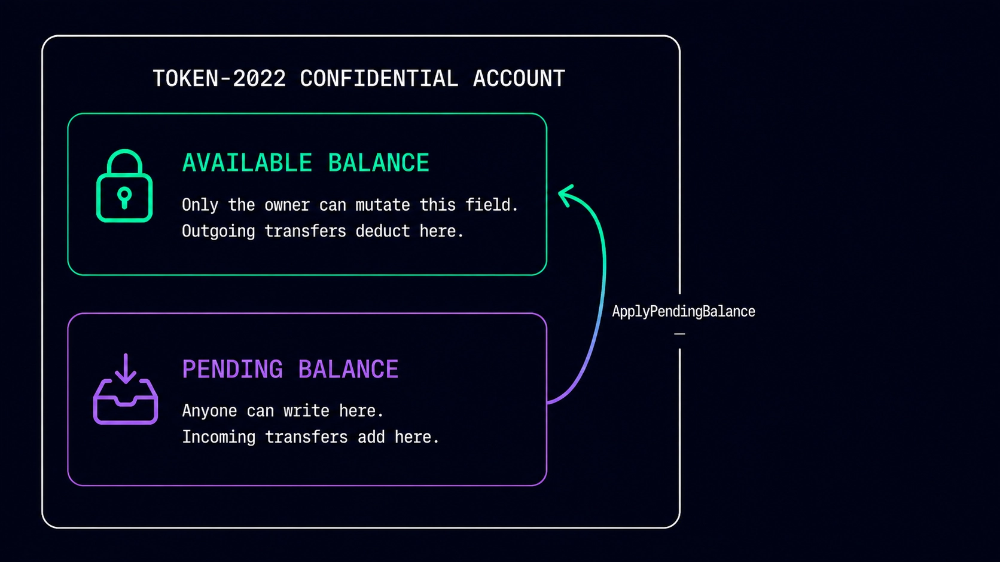
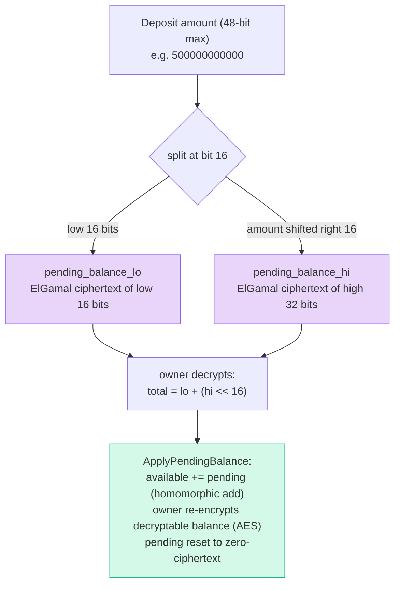

# Step 03 — Deposit and Apply: the Three Balances

## What happens in this step

We mint 1000 public tokens to Alice, move 500 of them into her confidential *pending* balance with a `Deposit`, and then fold that pending amount into her spendable *available* balance with `ApplyPendingBalance`. Watching the printed balances after each stage is the whole lesson: value flows public → pending → available, and only then is it spendable confidentially. One honest caveat to state on stage: the deposit **amount is public** — anyone can see 500 tokens entered the confidential system. Privacy starts once tokens are inside.



## Why does "pending" exist at all?

Because only the **owner** can re-encrypt their own running balance. Spending requires proving statements about your balance ciphertext — so that ciphertext must not change under your feet while other people credit you. The protocol solves this by giving incoming credits their own bucket:

- **pending** — where deposits and incoming transfers land. Anyone can *add* to it homomorphically (ElGamal ciphertexts can be added without decrypting!), nobody can spend from it.
- **available** — what you can spend. Only the owner ever rewrites it, via `ApplyPendingBalance`.

## The lo/hi ciphertext trick

The pending balance is stored as **two** ElGamal ciphertexts, not one. ElGamal decryption is a brute-force discrete-log search — feasible only for small numbers — so amounts are kept in small chunks:



Small exponents keep the discrete-log search fast; the owner reassembles the true amount as `lo + (hi << 16)`. (Our `helpers.ts` `decryptPending` does exactly this.)

## The key code (from `03-deposit-and-apply.ts`)

```ts
// public -> encrypted pending (the amount here is a PUBLIC instruction arg!)
getConfidentialDepositInstruction({
  token: address(alice.tokenAccount), mint,
  authority: aliceSigner, amount: DEPOSIT_AMOUNT, decimals: DECIMALS,
})

// pending -> available: Alice decrypts pending locally and re-encrypts
// her new available balance under her own AES key
getApplyConfidentialPendingBalanceInstructionFromToken({
  token: address(alice.tokenAccount),
  tokenAccount: token.data,
  authority: aliceSigner,
  elgamalSecretKey: keys.elgamalSecretKey,
  aesKey: keys.aesKey,
})
```

Run it:

```bash
NODE_OPTIONS=--experimental-wasm-modules npx tsx apps/web/scripts/workshop/03-deposit-and-apply.ts
```

Point at the three balance lines printed after each stage — public 1000/0/0 → 500/500/0 → 500/0/500.

## Protocol internals

`Deposit` — [processor.rs](https://github.com/solana-program/token-2022/blob/main/program/src/extension/confidential_transfer/processor.rs), `process_deposit`. The plaintext amount is split lo/hi and added **homomorphically** to the pending ciphertexts — the program never sees or needs the current pending value:

```rust
// A deposit amount must be a 48-bit number
let (amount_lo, amount_hi) = verify_and_split_deposit_amount(amount)?;

confidential_transfer_account.pending_balance_lo = ciphertext_arithmetic::add_to_with_offset(
    &confidential_transfer_account.elgamal_pubkey,
    &confidential_transfer_account.pending_balance_lo,
    amount_lo,
).ok_or(TokenError::CiphertextArithmeticFailed)?;
confidential_transfer_account.pending_balance_hi = ciphertext_arithmetic::add_to_with_offset(
    &confidential_transfer_account.elgamal_pubkey,
    &confidential_transfer_account.pending_balance_hi,
    amount_hi,
).ok_or(TokenError::CiphertextArithmeticFailed)?;

confidential_transfer_account.increment_pending_balance_credit_counter()?;
```

`ApplyPendingBalance` — same file, `process_apply_pending_balance`. Ciphertext addition on-chain, plus a credit-counter handshake that detects credits landing *between* the owner's decryption and this instruction executing:

```rust
confidential_transfer_account.available_balance = ciphertext_arithmetic::add_with_lo_hi(
    &confidential_transfer_account.available_balance,
    &confidential_transfer_account.pending_balance_lo,
    &confidential_transfer_account.pending_balance_hi,
).ok_or(TokenError::CiphertextArithmeticFailed)?;

confidential_transfer_account.expected_pending_balance_credit_counter =
    *expected_pending_balance_credit_counter;    // what the owner saw when signing
confidential_transfer_account.decryptable_available_balance =
    *new_decryptable_available_balance;          // owner's fresh AES cache
confidential_transfer_account.pending_balance_credit_counter = 0.into();
confidential_transfer_account.pending_balance_lo = EncryptedBalance::zeroed();
confidential_transfer_account.pending_balance_hi = EncryptedBalance::zeroed();
```

If `expected` ≠ `actual` counter, the owner's AES cache is stale — clients detect this and re-apply. The state fields live in [interface/src/extension/confidential_transfer/mod.rs](https://github.com/solana-program/token-2022/blob/main/interface/src/extension/confidential_transfer/mod.rs).

## What to say if asked

**"Why is the deposit amount public? Doesn't that leak everything?"**
Entering and exiting the confidential system is public (deposit/withdraw); movement *inside* it is not. Think of it like an on/off-ramp: observers see totals entering, but not how value moves once inside. Serious privacy usage keeps balances inside.

**"What happens if someone credits me while I'm applying?"**
That's what the credit counter is for — the owner signs the counter value they decrypted against; if more credits landed since, the mismatch is visible on-chain and the client re-applies. Funds are never lost, the AES cache is just refreshed.

**"Why 48-bit max deposits?"**
So the hi chunk stays ≤ 32 bits, keeping the owner's ElGamal discrete-log decryption tractable. Amounts larger than 2^48 raw units just take multiple deposits.
