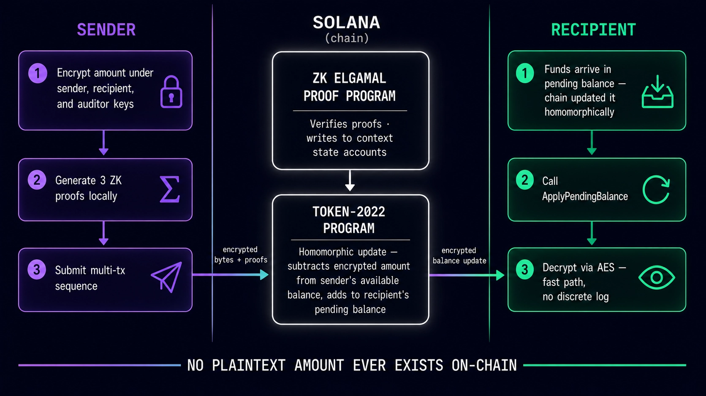
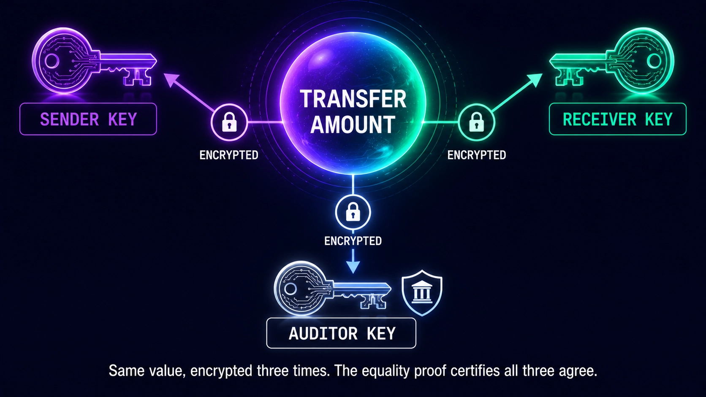
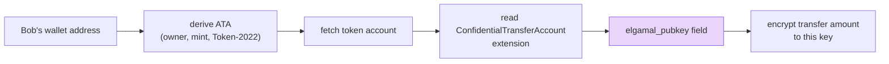
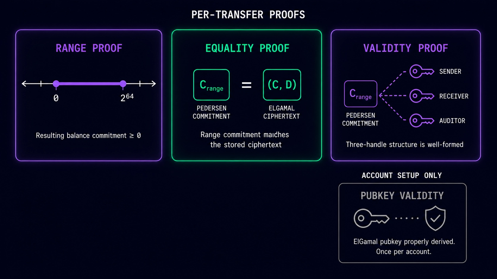
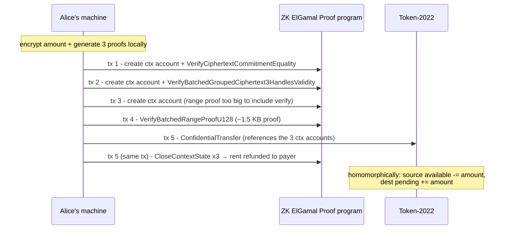

# Step 04 — The Confidential Transfer

## What happens in this step

Alice sends Bob 123 tokens and nobody watching the chain can tell how much. Her machine encrypts the amount three ways, computes her own new balance, and generates three zero-knowledge proofs *locally* — the chain only verifies. Because the proofs are far bigger than a Solana transaction, the transfer spans **five transactions**: three proofs get verified into temporary "context-state" scratch accounts, the actual transfer instruction points at them, and then the scratch accounts are closed with their rent refunded. This is the centerpiece of the workshop — read each transaction's label aloud as the script prints it.



## The amount is encrypted three ways



A single *grouped* ciphertext encrypts the same amount under three keys: the **sender's** (so Alice can still reckon her own balance), the **receiver's** (so Bob can decrypt what he got), and the **auditor's** (or a placeholder key if, as in our mint, there is no auditor). One of the three proofs exists precisely to show all three encryptions really contain the same number.

But first — how does Alice even find Bob's encryption key? She reads it off his token account:



No key exchange, no handshake — the pubkey Bob published in step 02 is sitting in public account data. (The script prints it.)

## The three proofs



| Proof | Claim it certifies | Attack it prevents |
|---|---|---|
| **Equality** | Alice's new encrypted balance = old balance − amount | conjuring tokens by lying about your new balance |
| **Ciphertext validity** | the grouped ciphertexts are well-formed and encrypt the same amount for sender/receiver/auditor | sending Bob garbage he can't decrypt, or showing the auditor a different number |
| **Range** (Bulletproof, u128) | amount and remaining balance are in range, i.e. non-negative | "sending −5 tokens" to print 5 for yourself |

## Why five transactions

A Solana transaction tops out at 1232 bytes; the range proof alone is roughly 1.5 KB. So each proof is verified up-front into a **context-state account** — a tiny scratch account whose only job is to record "this proof checked out". The transfer then just references the three accounts:



Context accounts are scratch space, not state: the net cost of a transfer is ~5 transaction fees; the rent comes back in tx 5.

One subtlety worth having in your pocket — the proofs are bound to a **snapshot of Alice's balance ciphertext**:


If Alice's available-balance ciphertext changes between proof generation and the transfer (say someone deposits dust to her and she applies it, or an attacker tries to replay her proof against different state), the equality proof no longer matches and the transfer fails. Proofs can't be replayed or reused against mutated state.

## The key code (from `04-confidential-transfer.ts`)

```ts
const plan = await getConfidentialTransferInstructionPlan({
  sourceToken: address(alice.tokenAccount),
  mint,
  destinationToken: address(bob.tokenAccount),
  sourceTokenAccount: sourceToken.data,        // snapshot the proofs bind to
  destinationTokenAccount: destinationToken.data,
  authority: aliceSigner,
  amount,
  sourceElgamalKeypair: aliceKeys.elgamalKeypair,
  aesKey: aliceKeys.aesKey,
  payer,
  rpc,
});
await executePlan(tools, plan);   // ~5 transactions, each labeled as it lands
```

Run it (amount in tokens optional, default 123):

```bash
NODE_OPTIONS=--experimental-wasm-modules npx tsx apps/web/scripts/workshop/04-confidential-transfer.ts
```

Open the **last** transaction in the explorer: no amount anywhere in the instruction data. Compare with any normal SPL transfer where the amount sits in plaintext.

## Protocol internals

The transfer verifies all three proof contexts before touching balances — [program/src/extension/confidential_transfer/verify_proof.rs](https://github.com/solana-program/token-2022/blob/main/program/src/extension/confidential_transfer/verify_proof.rs), `verify_transfer_proof`:

```rust
let equality_proof_context = verify_and_extract_context::<
    CiphertextCommitmentEqualityProofData,
    CiphertextCommitmentEqualityProofContext,
>(account_info_iter, equality_proof_instruction_offset, sysvar_account_info)?;

let ciphertext_validity_proof_context = verify_and_extract_context::<
    BatchedGroupedCiphertext3HandlesValidityProofData,
    BatchedGroupedCiphertext3HandlesValidityProofContext,
>(account_info_iter, ciphertext_validity_proof_instruction_offset, sysvar_account_info)?;

let range_proof_context =
    verify_and_extract_context::<BatchedRangeProofU128Data, BatchedRangeProofContext>(
        account_info_iter, range_proof_instruction_offset, sysvar_account_info)?;
```

And in [processor.rs](https://github.com/solana-program/token-2022/blob/main/program/src/extension/confidential_transfer/processor.rs), `process_transfer` spells out the contract (its own comment):

```rust
// The zero-knowledge proof certifies that:
//   1. the transfer amount is encrypted in the correct form
//   2. the source account has enough balance to send the transfer amount
let proof_context = verify_transfer_proof(
    account_info_iter,
    equality_proof_instruction_offset,
    transfer_amount_ciphertext_validity_proof_instruction_offset,
    range_proof_instruction_offset,
)?;
```

The scratch-account lifecycle is the ZK ElGamal Proof program's `CloseContextState` — [interface/src/instruction.rs](https://github.com/solana-program/zk-elgamal-proof/blob/main/interface/src/instruction.rs) in the zk-elgamal-proof repo:

```rust
pub enum ProofInstruction {
    /// Close a zero-knowledge proof context state.
    ///
    /// Accounts expected by this instruction:
    ///   0. `[writable]` The proof context account to close
    ///   1. `[writable]` The destination account for lamports
    ///   2. `[signer]` The context account's owner
    CloseContextState,
    ...
}
```

## What to say if asked

**"Why not one transaction?"**
The 1232-byte transaction limit versus a ~1.5 KB range proof (plus two more proofs and the transfer itself). Context-state accounts let each proof be verified in its own transaction, then referenced cheaply.

**"What stops someone replaying a proof, or frontrunning the transfer?"**
Proofs are cryptographically bound to the exact source-balance ciphertext they were generated against (see the race image above). Any change to that ciphertext — including attacker-injected dust that gets applied — invalidates the equality proof and the transfer fails closed.

**"Who pays for all this, and what does it cost?"**
Whoever signs as fee payer — here, one payer covers all five transactions and gets the context-account rent refunded in the final one. Net cost ≈ 5 transaction fees plus the (heavier) compute for on-chain proof verification.

**"Can validators or RPCs see the amount while it's in flight?"**
No — the amount never exists in plaintext anywhere in the transaction. Only ciphertexts and proofs travel; the sender's machine is the only place the number ever appears.
