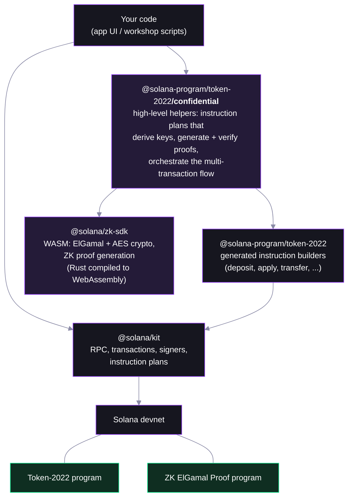

# Step 00 — The Libraries

Everything in this workshop — the [deployed app](https://confidential-transfers-explorer-web.vercel.app) and the step scripts — is built from four JavaScript packages. Nothing here reimplements cryptography: the same audited Rust that powers the Solana CLI runs in your browser and in Node, compiled to WebAssembly.

## The stack



## The packages

| Package | Version | Role |
|---|---|---|
| [`@solana/kit`](https://github.com/anza-xyz/kit) | 6.x | The base layer: RPC client, transaction building, signers, and **instruction plans** (multi-transaction orchestration). Successor to web3.js. |
| [`@solana-program/token-2022`](https://github.com/solana-program/token-2022) | 0.12+ | Generated builders for every Token-2022 instruction — and the **`/confidential` subpath**, the high-level helpers this workshop leans on. |
| [`@solana/zk-sdk`](https://www.npmjs.com/package/@solana/zk-sdk) | 0.4+ | The cryptography: ElGamal keypairs, AES keys, ciphertexts, and all ZK proof generation. Rust compiled to WASM — byte-identical behavior to the CLI. |
| [`@solana-program/system`](https://github.com/solana-program/system) | 0.12+ | System-program builders (create account, transfer SOL). |
| [`@solana/connector`](https://github.com/solana-foundation/connectorkit) | 0.2+ | ConnectorKit — Wallet Standard connection in the app (browser only; scripts use keypair signers). |

The one import that matters most:

```ts
import {
  getCreateConfidentialTransferAccountInstructionPlan,
  getConfidentialTransferInstructionPlan,
  getApplyConfidentialPendingBalanceInstructionFromToken,
} from '@solana-program/token-2022/confidential';
```

These return kit **instruction plans**: the transfer helper alone generates three ZK proofs, creates and verifies three context-state accounts, executes the transfer, and closes the accounts — you just execute the plan. Before these helpers existed, all of that was hand-rolled instruction bytes.

## Where each step uses them

| Step | Leans on |
|---|---|
| [01 — create mint](01-create-mint.md) | token-2022 builders + system |
| [02 — configure](02-configure-account.md) | zk-sdk (key derivation) + `/confidential` plan |
| [03 — deposit + apply](03-deposit-and-apply.md) | token-2022 builder + `/confidential` helper |
| [04 — transfer](04-confidential-transfer.md) | `/confidential` plan (the whole show) |
| [05 — decrypt](05-decrypt.md) | zk-sdk (ElGamal + AES decryption) |

## Runtime note: WASM

`@solana/zk-sdk` ships WebAssembly as ES modules. Two consequences:

- **Scripts run under Node** (22+) with the flag: `NODE_OPTIONS=--experimental-wasm-modules npx tsx workshop/01-create-mint.ts` — bun cannot load these modules yet.
- **In the browser**, the bundler handles it (`asyncWebAssembly` in the app's Next.js config) — proofs generate client-side; secrets never leave the page.

## FAQ

**Why kit 6.x and not 7?**
`@solana-program/token-2022` 0.12 declares a peer dependency on kit `^6.4`. Kit 7 works at runtime but fails peer resolution — pin 6.x until the peer range moves.

**Can I use web3.js v1 instead?**
Not for the confidential helpers — they're kit-native (instruction plans, kit signers). The low-level instruction builders could be adapted, but you'd be reimplementing the orchestration the helpers give you for free.

**Is the crypto in JavaScript?**
No. The zk-sdk is the same Rust code the Solana CLI uses (`solana-zk-sdk`), compiled to WASM. JavaScript only moves bytes in and out.

---

Next: [Step 01 — the mint](01-create-mint.md)
