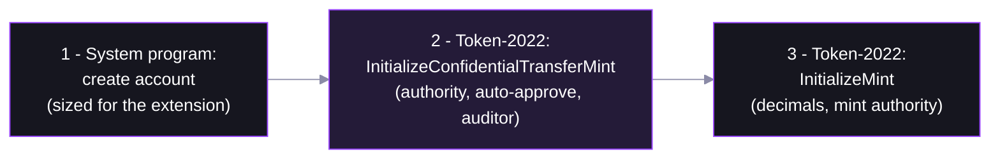

# Step 01 — Create a Confidential-Transfer Mint

## In the app

Every token the faucet hands out in the [deployed app](https://confidential-transfers-explorer-web.vercel.app) belongs to one mint, created once by the operator (`bun run setup:mint`) with confidential transfers enabled. The script below is a minimal standalone version of that creation — run it to make your own mint on devnet.

## What happens under the hood

An ordinary Token-2022 mint plus one extension — `ConfidentialTransferMint` — baked in at creation. That extension is the entire opt-in: no separate privacy program, no new token standard.


## The mechanics

One transaction, three instructions — the extension initializes **before** the mint, because `InitializeMint` finalizes the account layout:



Three configuration choices matter:

| Field | Our value | What it controls |
|---|---|---|
| `authority` | the payer | who can change this config later |
| `autoApproveNewAccounts` | `true` | anyone may configure a confidential account; set `false` for allowlist-style onboarding |
| `auditorElgamalPubkey` | `null` | if set, **every transfer amount is also encrypted to this key** — one designated party can decrypt amounts. Compliance without a public ledger. |

## The key code (from `01-create-mint.ts`)

```ts
const ctMintExtension = extension('ConfidentialTransferMint', {
  authority: payer.address,          // can update the CT config later
  autoApproveNewAccounts: true,      // no gatekeeping: anyone can opt in
  auditorElgamalPubkey: null,        // no auditor — amounts visible to NO third party
});
const space = BigInt(getMintSize([ctMintExtension]));

await executePlan(tools, nonDivisibleSequentialInstructionPlan([
  getCreateAccountInstruction({ payer, newAccount: mintSigner, lamports: rent, space, programAddress: TOKEN_2022_PROGRAM_ADDRESS }),
  getInitializeConfidentialTransferMintInstruction({ mint, authority: payer.address, autoApproveNewAccounts: true, auditorElgamalPubkey: null }),
  getInitializeMintInstruction({ mint, decimals: DECIMALS, mintAuthority: payer.address, freezeAuthority: null }),
]));
```

Run it:

```bash
NODE_OPTIONS=--experimental-wasm-modules npx tsx workshop/01-create-mint.ts
```

Then open the printed mint address in the explorer: the `ConfidentialTransferMint` extension sits right next to ordinary mint data.

## Protocol internals

The exact struct the extension writes on-chain — [interface/src/extension/confidential_transfer/mod.rs](https://github.com/solana-program/token-2022/blob/main/interface/src/extension/confidential_transfer/mod.rs):

```rust
pub struct ConfidentialTransferMint {
    /// Authority to modify the `ConfidentialTransferMint` configuration and to
    /// approve new accounts (if `auto_approve_new_accounts` is true)
    pub authority: MaybeNull<Address>,

    /// Indicate if newly configured accounts must be approved by the
    /// `authority` before they may be used by the user.
    pub auto_approve_new_accounts: Bool,

    /// Authority to decode any transfer amount in a confidential transfer.
    pub auditor_elgamal_pubkey: MaybeNull<PodElGamalPubkey>,
}
```

Instruction processing: [processor.rs](https://github.com/solana-program/token-2022/blob/main/program/src/extension/confidential_transfer/processor.rs).

## Confidential mint & burn

`ConfidentialTransferMint` hides *transfer* amounts — but plain `MintTo`/`Burn` still change the mint's **public supply**, and those deltas leak information. The separate `ConfidentialMintBurn` extension closes that hole: mint and burn amounts are encrypted too, so supply stays confidential.

| Action | `ConfidentialTransferMint` only | + `ConfidentialMintBurn` |
|---|---|---|
| Transfer | amount encrypted | amount encrypted |
| Mint / burn | public supply changes — leaks amounts | encrypted; supply stays confidential |

See `getInitializeConfidentialMintBurnInstruction` in `@solana-program/token-2022`, and the [confidential_mint_burn extension](https://github.com/solana-program/token-2022/tree/main/program/src/extension/confidential_mint_burn) in the program source.

## FAQ

**Can I add confidential transfers to my existing token?**
No — mint extensions must be set at creation because they change the account layout. You'd launch a new Token-2022 mint (or a wrapped version) with the extension.

**Does the auditor see who is transacting, or just amounts?**
Sender and receiver accounts are public on every transfer anyway — only the amount is encrypted, and the auditor key lets that one party decrypt amounts too.

**Is this live on mainnet?**
Yes — Token-2022 and the ZK ElGamal Proof program are live on mainnet-beta; check current feature-gate status for your cluster before shipping.
