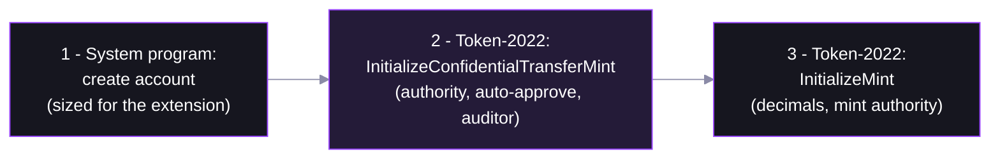

# Step 01 — Create a Confidential-Transfer Mint




| Field | Our value | What it controls |
|---|---|---|
| `authority` | the payer | who can change this config later |
| `autoApproveNewAccounts` | `true` | anyone may configure a confidential account |
| `auditorElgamalPubkey` | `null` | if set, every transfer amount is also decryptable by this one key |

## The helpers

No one-shot helper — three builders, extension **before** `InitializeMint`:

- **`getCreateAccountInstruction`** (`@solana-program/system`) — sized with `getMintSize([extension('ConfidentialTransferMint', {...})])`

  ```ts
  getCreateAccountInstruction({ payer, newAccount, lamports, space, programAddress: TOKEN_2022_PROGRAM_ADDRESS })
  ```

- **`getInitializeConfidentialTransferMintInstruction`** (`@solana-program/token-2022`)

  ```ts
  getInitializeConfidentialTransferMintInstruction({ mint, authority, autoApproveNewAccounts, auditorElgamalPubkey })
  ```

- **`getInitializeMintInstruction`** (`@solana-program/token-2022`)

  ```ts
  getInitializeMintInstruction({ mint, decimals, mintAuthority, freezeAuthority })
  ```

## Confidential mint & burn

| Action | `ConfidentialTransferMint` only | + `ConfidentialMintBurn` |
|---|---|---|
| Transfer | amount encrypted | amount encrypted |
| Mint / burn | public supply changes — leaks amounts | encrypted; supply stays confidential |

- **`getInitializeConfidentialMintBurnInstruction`** (`@solana-program/token-2022`) — [extension source](https://github.com/solana-program/token-2022/tree/main/program/src/extension/confidential_mint_burn)
