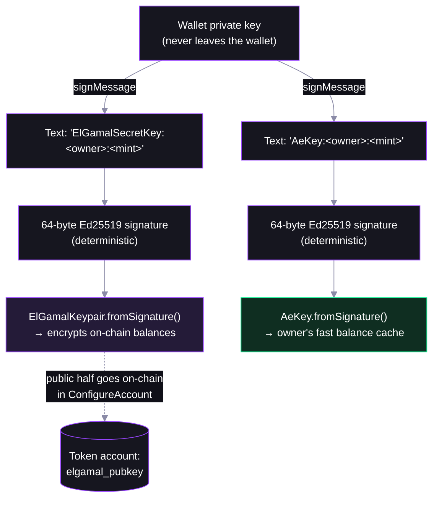

# Step 02 — Owners, Signature-Derived Keys, and Account Configuration

## In the app

In the [deployed app](https://confidential-transfers-explorer-web.vercel.app), a token that hasn't opted in shows a **Configure Confidential** button. Click it and your wallet prompts you to sign **two short text messages** before any transaction goes out — those two signatures are where your encryption keys come from. Production code: [`confidentialTransfer.ts`](https://github.com/catmcgee/confidential-transfers-explorer/blob/main/apps/web/src/lib/confidentialTransfer.ts) · [`TransferModal.tsx`](https://github.com/catmcgee/confidential-transfers-explorer/blob/main/apps/web/src/components/TransferModal.tsx).

## What happens under the hood

The script gives two fresh test wallets — Alice and Bob — a *confidential-ready* token account each. Each owner signs two readable messages, the signatures become an ElGamal keypair and an AES key, and configuring publishes the ElGamal *public* key on-chain — what senders encrypt to, and why recipients must configure **before** anyone can send to them.

## Key derivation: signatures over readable text

Nothing is generated randomly and nothing is stored — the keys are a pure function of (wallet, owner, mint):



- **Deterministic = re-derivable anywhere.** Same text, same wallet → same keys, on any device, forever.
- **Readable text** because wallets like Phantom refuse opaque binary `signMessage` payloads — and it's the exact scheme the web app uses.
- **Per owner AND per mint** — one mint's keys reveal nothing about another's.

## Configuration also needs a proof

The chain won't store an ElGamal pubkey unless you prove it's well-formed — a malformed pubkey could make funds sent to you unspendable. This is the **pubkey-validity proof**: a one-time proof that you hold the secret key behind the pubkey you're publishing. (The three heavier proofs — range, equality, validity — are per-*transfer* and come in [step 04](04-confidential-transfer.md).)

The setup transaction bundles: create ATA → reallocate for the extension → configure → **verify pubkey-validity proof**.

## The key code (from `02-configure-account.ts`)

```ts
// helpers.ts — deriveCtKeys: matches the web app exactly
const elgamalKeypair = ElGamalKeypair.fromSignature(await signText(`ElGamalSecretKey:${signer.address}:${mint}`));
const aesKey = AeKey.fromSignature(await signText(`AeKey:${signer.address}:${mint}`));

// 02-configure-account.ts — one plan does ATA create + reallocate + configure + proof
await executePlan(tools, await getCreateConfidentialTransferAccountInstructionPlan({
  payer,
  owner: alice.signer,
  mint,
  rpc,
  elgamalKeypair: aliceKeys.elgamalKeypair,
  aesKey: aliceKeys.aesKey,
}));
```

Run it:

```bash
NODE_OPTIONS=--experimental-wasm-modules npx tsx workshop/02-configure-account.ts
```

The script prints the literal message strings being signed — the same text your wallet shows in the app. Then find the `ConfidentialTransferAccount` extension (with `elgamalPubkey`) on a token account in the explorer.

## Protocol internals

`ConfigureAccount` processing — [processor.rs](https://github.com/solana-program/token-2022/blob/main/program/src/extension/confidential_transfer/processor.rs), `process_configure_account`. The pubkey is only accepted out of a *verified proof context*, then written with zeroed balances:

```rust
let elgamal_pubkey = match elgamal_pubkey_source {
    ElGamalPubkeySource::ProofInstructionOffset(offset) => {
        // zero-knowledge proof certifies that the supplied ElGamal public key is valid
        let proof_context = verify_and_extract_context::<
            PubkeyValidityProofData,
            PubkeyValidityProofContext,
        >(account_info_iter, offset, None)?;
        proof_context.pubkey
    }
    ...
};
...
confidential_transfer_account.approved = confidential_transfer_mint.auto_approve_new_accounts;
confidential_transfer_account.elgamal_pubkey = elgamal_pubkey;
...
// The all-zero ciphertext [0; 64] is a valid encryption of zero
confidential_transfer_account.pending_balance_lo = EncryptedBalance::zeroed();
confidential_transfer_account.pending_balance_hi = EncryptedBalance::zeroed();
confidential_transfer_account.available_balance = EncryptedBalance::zeroed();
```

Note: `approved` comes straight from the step 01 `auto_approve_new_accounts` choice, and all-zero bytes are a *valid ElGamal encryption of zero*.

## FAQ

**What if I lose my ElGamal key?**
You can't — it's re-derived from a wallet signature whenever needed. Losing the *wallet* key is the real risk, same as today.

**One key for every token, or one per mint?**
Per `(owner, mint)` pair here. The protocol also supports a global `ElGamalRegistry` variant (`ConfigureAccountWithRegistry`) — the other match arm in the processor code above.

**Can someone send me confidential tokens before I configure?**
No — there's no ElGamal pubkey on your account to encrypt to. That's why configuration is the onboarding step for recipients.
