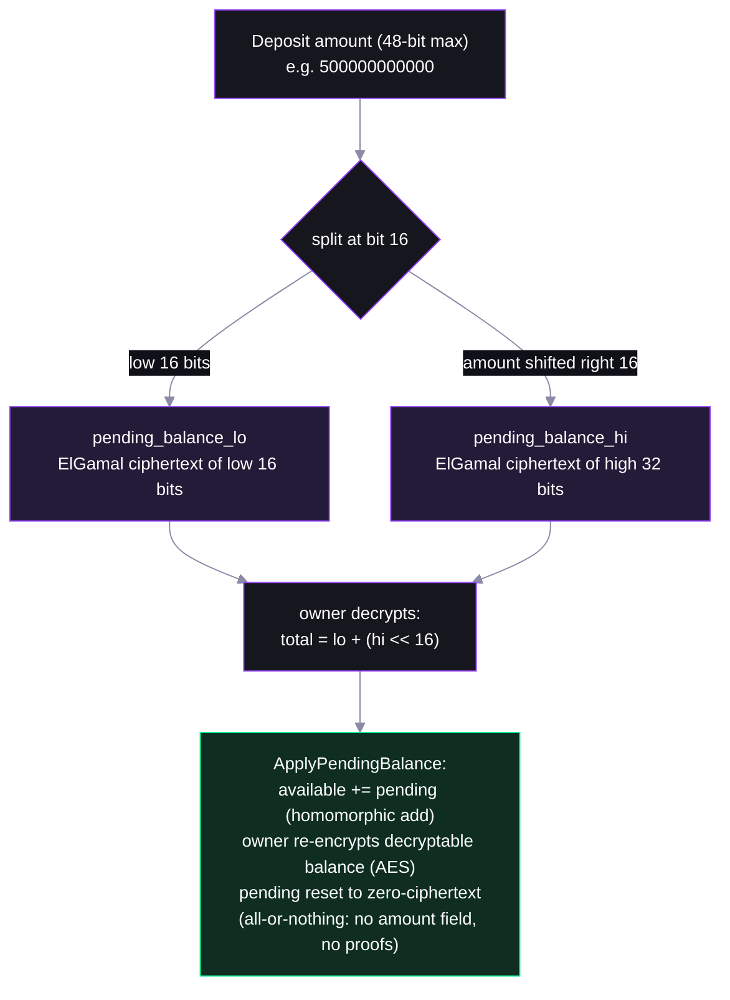

# Step 02 — Deposit and Apply: the Three Balances


## Why pending exists


## The lo/hi ciphertext trick



## The helpers

- **`getConfidentialDepositInstruction`** (`@solana-program/token-2022`) — public → pending; no proofs, amount is public

  ```ts
  getConfidentialDepositInstruction({ token, mint, authority, amount, decimals })
  ```

- **`getApplyConfidentialPendingBalanceInstructionFromToken`** (`@solana-program/token-2022/confidential`) — pending → available, all of it, no proofs

  ```ts
  const token = await fetchToken(rpc, tokenAddress);
  getApplyConfidentialPendingBalanceInstructionFromToken({ token, tokenAccount: token.data, authority, elgamalSecretKey, aesKey })
  ```
