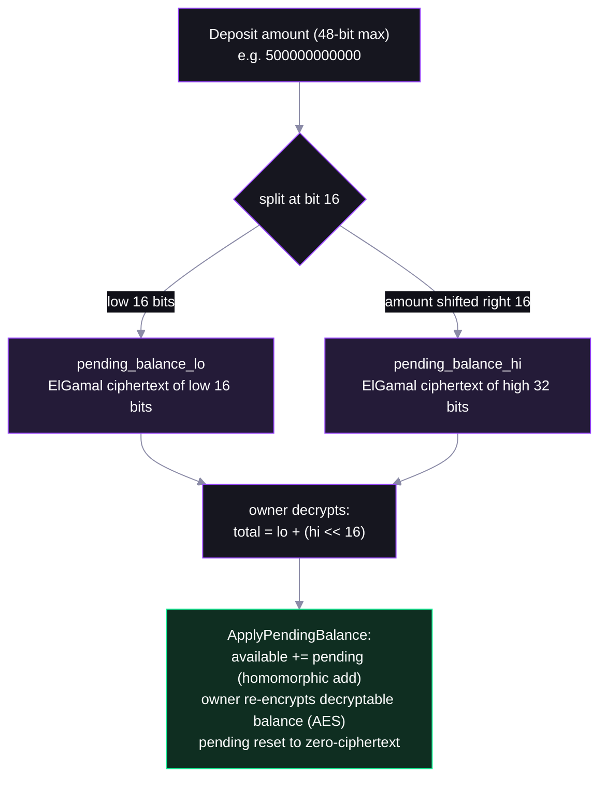

# Step 02 — Deposit and Apply: the Three Balances

## In the app

Once a token is configured, the [deployed app](https://confidential-transfers-explorer-web.vercel.app) shows two more buttons: **Deposit** (public → pending) and **Apply Pending** (pending → available). This step is those two buttons under the hood. Production code: [`confidentialTransfer.ts`](https://github.com/catmcgee/confidential-transfers-explorer/blob/main/apps/web/src/lib/confidentialTransfer.ts) · [`TransferModal.tsx`](https://github.com/catmcgee/confidential-transfers-explorer/blob/main/apps/web/src/components/TransferModal.tsx).

## What happens under the hood

The script mints 1000 public tokens to Alice, `Deposit`s 500 into her *pending* balance, then folds pending into spendable *available* with `ApplyPendingBalance`. Value flows public → pending → available — and note the deposit **amount is public**; privacy starts once tokens are inside.

(The script first sets up Alice's confidential token account quietly — an account has to be configured with an encryption key before it can hold encrypted balances. What that configuration actually does is [step 04](04-configure-account.md)'s deep-dive.)


## Why does "pending" exist at all?

Because only the **owner** can re-encrypt their own running balance, incoming credits get their own bucket:

- **pending** — where deposits and incoming transfers land. Anyone can *add* to it homomorphically (ElGamal ciphertexts add without decrypting!), nobody can spend from it.
- **available** — what you can spend. Only the owner rewrites it, via `ApplyPendingBalance`.

## The lo/hi ciphertext trick

ElGamal decryption is a brute-force discrete-log search — feasible only for small numbers — so the pending balance is stored as **two** ciphertexts of small chunks:



The owner reassembles the true amount as `lo + (hi << 16)` — `decryptPending` in `helpers.ts` does exactly this.

## The helpers

One call per instruction:

- **`getConfidentialDepositInstruction`** (`@solana-program/token-2022`) — public → pending. A plain instruction builder, not a plan: deposits involve no proofs, so nothing else is needed. The amount is a public instruction argument.

  ```ts
  getConfidentialDepositInstruction({ token, mint, authority, amount, decimals })
  ```

- **`getApplyConfidentialPendingBalanceInstructionFromToken`** (`@solana-program/token-2022/confidential`) — pending → available. It fetches nothing itself: you pass an already-fetched token account (`fetchToken` from `@solana-program/token-2022`), and it decrypts the pending balance and re-encrypts the owner's decryptable balance locally.

  ```ts
  const token = await fetchToken(rpc, tokenAddress);
  getApplyConfidentialPendingBalanceInstructionFromToken({ token, tokenAccount: token.data, authority, elgamalSecretKey, aesKey })
  ```

Watch the three balance lines printed after each stage — 1000/0/0 → 500/500/0 → 500/0/500.

## Protocol internals

`Deposit` — [processor.rs](https://github.com/solana-program/token-2022/blob/main/program/src/extension/confidential_transfer/processor.rs), `process_deposit`. The plaintext amount is split lo/hi and added **homomorphically** — the program never sees the current pending value:

```rust
// A deposit amount must be a 48-bit number
let (amount_lo, amount_hi) = verify_and_split_deposit_amount(amount)?;

confidential_transfer_account.pending_balance_lo = ciphertext_arithmetic::add_to_with_offset(
    &confidential_transfer_account.elgamal_pubkey,
    &confidential_transfer_account.pending_balance_lo,
    amount_lo,
).ok_or(TokenError::CiphertextArithmeticFailed)?;
confidential_transfer_account.pending_balance_hi = ciphertext_arithmetic::add_to_with_offset(
    &confidential_transfer_account.elgamal_pubkey,
    &confidential_transfer_account.pending_balance_hi,
    amount_hi,
).ok_or(TokenError::CiphertextArithmeticFailed)?;

confidential_transfer_account.increment_pending_balance_credit_counter()?;
```

`ApplyPendingBalance` (`process_apply_pending_balance`, same file) is more ciphertext addition plus the credit-counter handshake. State fields: [interface/src/extension/confidential_transfer/mod.rs](https://github.com/solana-program/token-2022/blob/main/interface/src/extension/confidential_transfer/mod.rs).

## FAQ

**Why is the deposit amount public? Doesn't that leak everything?**
Entering and exiting the confidential system is public; movement *inside* it is not. Observers see totals entering, not how value moves once inside.

**What happens if someone credits me while I'm applying?**
The credit counter catches it: the owner signs the counter value they decrypted against, a mismatch is visible on-chain, and the client re-applies. Funds are never lost.

**Why 48-bit max deposits?**
So the hi chunk stays ≤ 32 bits, keeping ElGamal discrete-log decryption tractable. Larger amounts just take multiple deposits.
