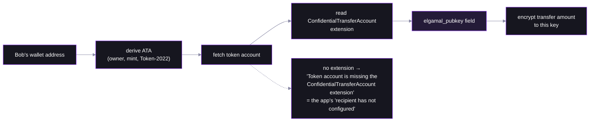
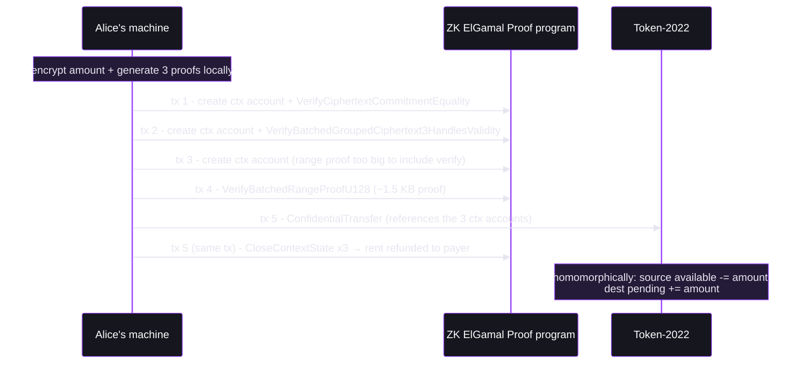

# Step 03 — The Confidential Transfer


## Finding the recipient's key (and why unconfigured recipients fail)



## The amount is encrypted three ways


## The three proofs


| Proof | Claim it certifies | Attack it prevents |
|---|---|---|
| **Equality** | Alice's new encrypted balance = old balance − amount | conjuring tokens by lying about your new balance |
| **Ciphertext validity** | the grouped ciphertexts encrypt the same amount for sender/receiver/auditor | sending Bob garbage he can't decrypt |
| **Range** (Bulletproof, u128) | amount and remaining balance are non-negative | "sending −5 tokens" to print 5 for yourself |

## Why five transactions



## The helpers

- **`getConfidentialTransferInstructionPlan`** (`@solana-program/token-2022/confidential`) — the whole flow: three proofs, context-state lifecycle, transfer. The fetched accounts you pass in are the snapshot the proofs bind to.

  ```ts
  await getConfidentialTransferInstructionPlan({ sourceToken, destinationToken, mint, authority, amount,
    sourceTokenAccount, destinationTokenAccount, sourceElgamalKeypair, aesKey, payer, rpc })
  ```

- **`createTransactionPlanner`** + **`createTransactionPlanExecutor`** (`@solana/kit`) — pack the plan into ~5 transactions, sign and send each

- **`getConfidentialWithdrawInstructionPlan`** (`@solana-program/token-2022/confidential`) — the withdraw sibling: encrypted available → public, same proof machinery
