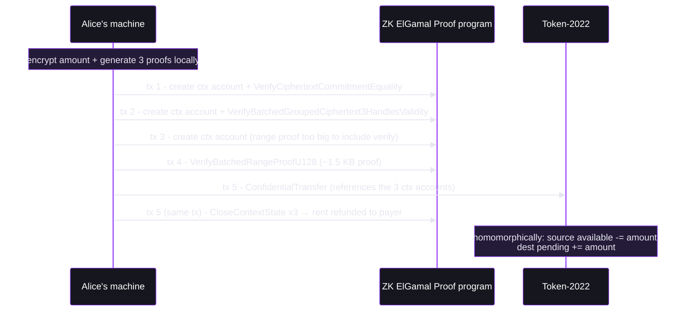
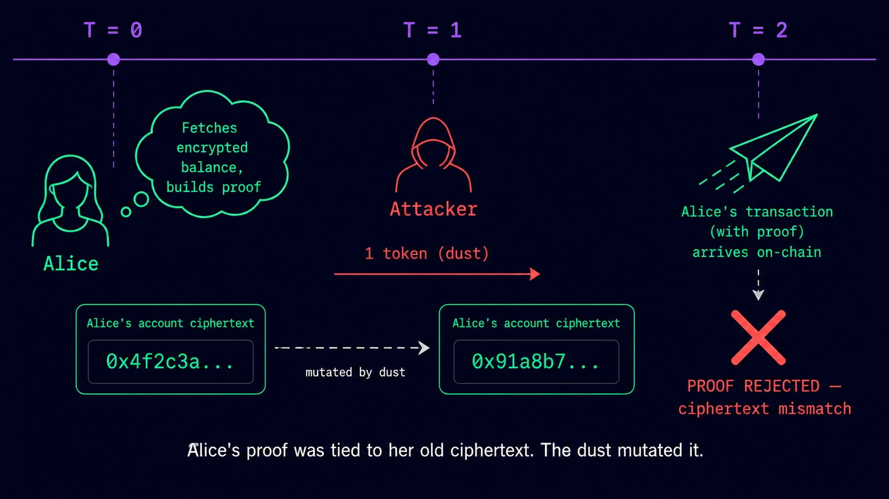

# Step 04 — The Confidential Transfer

## In the app

When you click **Send** in the [deployed app](https://confidential-transfers-explorer-web.vercel.app), a progress bar counts through several transactions — "generating ZK proofs", then "X of ~Y transactions confirmed". This step explains why. Production code: [`confidentialTransfer.ts`](https://github.com/catmcgee/confidential-transfers-explorer/blob/main/apps/web/src/lib/confidentialTransfer.ts) · [`TransferModal.tsx`](https://github.com/catmcgee/confidential-transfers-explorer/blob/main/apps/web/src/components/TransferModal.tsx).

## What happens under the hood

Alice sends Bob 123 tokens and nobody watching the chain can tell how much. Her machine encrypts the amount and generates three ZK proofs *locally*; the chain only verifies. The proofs outsize a Solana transaction, so the transfer spans **five transactions** — the script labels each one as it lands.


## The amount is encrypted three ways


One *grouped* ciphertext encrypts the same amount under three keys: sender's, receiver's, and auditor's (or a placeholder if, as here, there is no auditor).

Alice finds Bob's encryption key by reading it off his token account — no key exchange, no handshake:

```mermaid
%%{init: {'theme':'base','themeVariables':{'background':'transparent','primaryColor':'#16161f','primaryTextColor':'#ffffff','primaryBorderColor':'#9945FF','secondaryColor':'#0f2e21','secondaryTextColor':'#ffffff','secondaryBorderColor':'#14F195','tertiaryColor':'#241b38','tertiaryTextColor':'#ffffff','lineColor':'#8b8ba7','textColor':'#e6e6f0','fontSize':'14px','clusterBkg':'#101018','clusterBorder':'#3a3a4d','edgeLabelBackground':'#101018','actorBkg':'#16161f','actorTextColor':'#ffffff','actorBorder':'#9945FF','signalColor':'#e6e6f0','signalTextColor':'#e6e6f0','noteBkgColor':'#241b38','noteTextColor':'#e6e6f0','noteBorderColor':'#9945FF','labelBoxBkgColor':'#16161f','labelTextColor':'#ffffff','loopTextColor':'#e6e6f0'}}}%%
flowchart LR
    ADDR["Bob's wallet address"] --> ATA["derive ATA<br/>(owner, mint, Token-2022)"]
    ATA --> FETCH["fetch token account"]
    FETCH --> EXT["read ConfidentialTransferAccount<br/>extension"]
    EXT --> PK["elgamal_pubkey field"]
    PK --> ENC["encrypt transfer amount<br/>to this key"]
    classDef accent fill:#241b38,stroke:#9945FF,color:#ffffff
    class PK accent
```



This lookup is the app's "Configured / Not configured" check on a recipient address.

## The three proofs


| Proof | Claim it certifies | Attack it prevents |
|---|---|---|
| **Equality** | Alice's new encrypted balance = old balance − amount | conjuring tokens by lying about your new balance |
| **Ciphertext validity** | the grouped ciphertexts are well-formed and encrypt the same amount for sender/receiver/auditor | sending Bob garbage he can't decrypt, or showing the auditor a different number |
| **Range** (Bulletproof, u128) | amount and remaining balance are in range, i.e. non-negative | "sending −5 tokens" to print 5 for yourself |

## Why five transactions

A transaction tops out at 1232 bytes; the range proof alone is ~1.5 KB. So each proof is verified up-front into a **context-state account** — scratch space recording "this proof checked out" — and the transfer references the three:



Net cost ≈ 5 transaction fees — the rent comes back in tx 5. This is exactly what the app's progress bar counts.

One subtlety — the proofs bind to a **snapshot of Alice's balance ciphertext**:



If that ciphertext changes before the transfer lands (applied dust, replay against mutated state), the equality proof no longer matches and the transfer fails closed.

## The key code (from `04-confidential-transfer.ts`)

```ts
const plan = await getConfidentialTransferInstructionPlan({
  sourceToken: address(alice.tokenAccount),
  mint,
  destinationToken: address(bob.tokenAccount),
  sourceTokenAccount: sourceToken.data,        // snapshot the proofs bind to
  destinationTokenAccount: destinationToken.data,
  authority: aliceSigner,
  amount,
  sourceElgamalKeypair: aliceKeys.elgamalKeypair,
  aesKey: aliceKeys.aesKey,
  payer,
  rpc,
});
await executePlan(tools, plan);   // ~5 transactions, each labeled as it lands
```

Run it (amount in tokens optional, default 123):

```bash
NODE_OPTIONS=--experimental-wasm-modules npx tsx workshop/04-confidential-transfer.ts
```

Open the **last** transaction in the explorer: no amount anywhere in the instruction data.

## Protocol internals

The transfer verifies all three proof contexts before touching balances — [verify_proof.rs](https://github.com/solana-program/token-2022/blob/main/program/src/extension/confidential_transfer/verify_proof.rs), `verify_transfer_proof`:

```rust
let equality_proof_context = verify_and_extract_context::<
    CiphertextCommitmentEqualityProofData,
    CiphertextCommitmentEqualityProofContext,
>(account_info_iter, equality_proof_instruction_offset, sysvar_account_info)?;

let ciphertext_validity_proof_context = verify_and_extract_context::<
    BatchedGroupedCiphertext3HandlesValidityProofData,
    BatchedGroupedCiphertext3HandlesValidityProofContext,
>(account_info_iter, ciphertext_validity_proof_instruction_offset, sysvar_account_info)?;

let range_proof_context =
    verify_and_extract_context::<BatchedRangeProofU128Data, BatchedRangeProofContext>(
        account_info_iter, range_proof_instruction_offset, sysvar_account_info)?;
```

The transfer itself is `process_transfer` in [processor.rs](https://github.com/solana-program/token-2022/blob/main/program/src/extension/confidential_transfer/processor.rs); the scratch-account lifecycle is `CloseContextState` in the ZK ElGamal Proof program's [interface/src/instruction.rs](https://github.com/solana-program/zk-elgamal-proof/blob/main/interface/src/instruction.rs).

## FAQ

**Why not one transaction?**
The 1232-byte transaction limit versus a ~1.5 KB range proof (plus two more proofs and the transfer itself).

**What stops someone replaying a proof, or frontrunning the transfer?**
Proofs are bound to the exact source-balance ciphertext they were generated against; any change invalidates the equality proof and the transfer fails closed.

**Who pays for all this, and what does it cost?**
One fee payer covers all five transactions and gets the context-account rent refunded in the last one — net ≈ 5 transaction fees plus heavier verification compute.

**Can validators or RPCs see the amount while it's in flight?**
No — only ciphertexts and proofs travel; the sender's machine is the only place the plaintext number ever exists.

**What exactly are the five transactions?**
1) create + verify the **equality proof** into a context account, 2) create + verify the **validity proof**, 3) **create** the range-proof context account, 4) **verify the range proof** (it's too large to share a transaction with its account creation), 5) the **transfer itself** referencing the three verified contexts, plus closing all three (rent refunded).

**Why does the wallet warn on some of these transactions but not others?**
Wallets simulate each transaction and warn when they can't decode the effect. The proof transactions interact with the ZK ElGamal Proof program — young enough that wallets don't recognize it — and their only visible effect is SOL leaving for rent, so they get the generic caution banner. The final transaction is a Token-2022 instruction wallets do recognize, so it renders normally. The warnings mean "I can't summarize this," not "this is dangerous."
