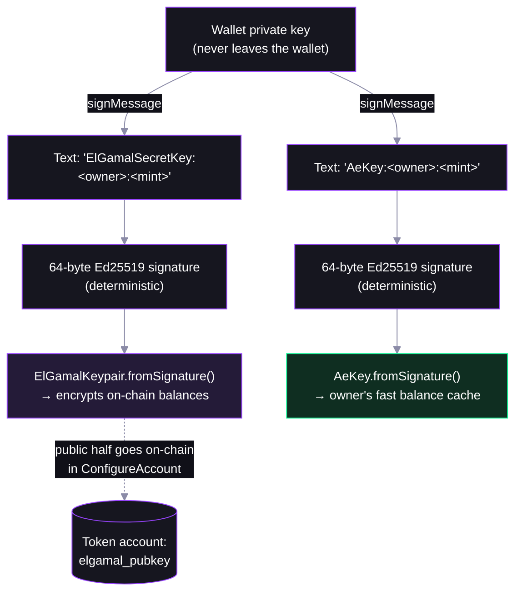

# Step 04 — Owners, Signature-Derived Keys, and Account Configuration

## In the app

You've just watched a transfer **fail** against an unconfigured recipient ([step 03](03-confidential-transfer.md)) — this step is the fix. In the [deployed app](https://confidential-transfers-explorer-web.vercel.app), a token that hasn't opted in shows a **Configure Confidential** button (and an unconfigured recipient address makes **Send** refuse with "recipient has not configured"). Click it and your wallet prompts you to sign **two short text messages** before any transaction goes out — those two signatures are where your encryption keys come from. Production code: [`confidentialTransfer.ts`](https://github.com/catmcgee/confidential-transfers-explorer/blob/main/apps/web/src/lib/confidentialTransfer.ts) · [`TransferModal.tsx`](https://github.com/catmcgee/confidential-transfers-explorer/blob/main/apps/web/src/components/TransferModal.tsx).

## What happens under the hood

Alice's and Bob's accounts were already configured "quietly" — Alice's in [step 02](02-deposit-and-apply.md), Bob's in [step 03](03-confidential-transfer.md) right after the failed attempt. This script sends **no new transactions**: it re-derives both owners' keys from scratch and checks them against the chain. Each owner signs two readable messages, the signatures become an ElGamal keypair and an AES key, and configuring published the ElGamal *public* key on-chain — what senders encrypt to. That's why the step 03 transfer to unconfigured Bob had nothing to encrypt to: you watched exactly what happens when a recipient hasn't configured. The side-by-side re-derived vs on-chain pubkeys matching, with no stored secrets and no new transaction, is the proof that keys are a pure function of (wallet, mint).

## Key derivation: signatures over readable text

Nothing is generated randomly and nothing is stored — the keys are a pure function of (wallet, owner, mint):



- **Deterministic = re-derivable anywhere.** Same text, same wallet → same keys, on any device, forever.
- **Readable text** because wallets like Phantom refuse opaque binary `signMessage` payloads — and it's the exact scheme the web app uses.
- **Per owner AND per mint** — one mint's keys reveal nothing about another's.

## Configuration also needs a proof

The chain won't store an ElGamal pubkey unless you prove it's well-formed — a malformed pubkey could make funds sent to you unspendable. This is the **pubkey-validity proof**: a one-time proof that you hold the secret key behind the pubkey you're publishing. (The three heavier proofs — range, equality, validity — are per-*transfer*; you already saw them in [step 03](03-confidential-transfer.md).)

The setup transaction bundles: create ATA → reallocate for the extension → configure → **verify pubkey-validity proof**. That's the transaction you saw fly by in steps 02 and 03.

## The helpers

Account setup is a single helper:

- **`getCreateConfidentialTransferAccountInstructionPlan`** (`@solana-program/token-2022/confidential`) — one plan that creates the ATA, reallocates it for the extension, configures the account, and verifies the pubkey-validity proof.

  ```ts
  await getCreateConfidentialTransferAccountInstructionPlan({ payer, owner, mint, rpc, elgamalKeypair, aesKey })
  ```

For the keys it takes, there are official helpers — with one important caveat:

- **`deriveElGamalKeypairForOwnerMint`** / **`deriveAeKeyForOwnerMint`** (`@solana-program/token-2022/confidential`) — derive the keys from a wallet signature, but they ask the signer to sign a **raw-byte** message, which Phantom refuses ("You cannot sign solana transactions using sign message"). Use them with keypair signers (scripts, backends).

  ```ts
  await deriveElGamalKeypairForOwnerMint({ signer, owner, mint })
  ```

- **`ElGamalKeypair.fromSignature`** / **`AeKey.fromSignature`** (`@solana/zk-sdk`) — what this repo uses instead: sign human-readable text with the wallet, then turn the 64-byte signature into keys directly. Browser-wallet friendly, same determinism.

  ```ts
  ElGamalKeypair.fromSignature(await signText(`ElGamalSecretKey:${owner}:${mint}`))
  AeKey.fromSignature(await signText(`AeKey:${owner}:${mint}`))
  ```

The script prints the literal message strings being signed — the same text your wallet shows in the app. Then find the `ConfidentialTransferAccount` extension (with `elgamalPubkey`) on a token account in the explorer.

## Protocol internals

`ConfigureAccount` processing — [processor.rs](https://github.com/solana-program/token-2022/blob/main/program/src/extension/confidential_transfer/processor.rs), `process_configure_account`. The pubkey is only accepted out of a *verified proof context*, then written with zeroed balances:

```rust
let elgamal_pubkey = match elgamal_pubkey_source {
    ElGamalPubkeySource::ProofInstructionOffset(offset) => {
        // zero-knowledge proof certifies that the supplied ElGamal public key is valid
        let proof_context = verify_and_extract_context::<
            PubkeyValidityProofData,
            PubkeyValidityProofContext,
        >(account_info_iter, offset, None)?;
        proof_context.pubkey
    }
    ...
};
...
confidential_transfer_account.approved = confidential_transfer_mint.auto_approve_new_accounts;
confidential_transfer_account.elgamal_pubkey = elgamal_pubkey;
...
// The all-zero ciphertext [0; 64] is a valid encryption of zero
confidential_transfer_account.pending_balance_lo = EncryptedBalance::zeroed();
confidential_transfer_account.pending_balance_hi = EncryptedBalance::zeroed();
confidential_transfer_account.available_balance = EncryptedBalance::zeroed();
```

Note: `approved` comes straight from the step 01 `auto_approve_new_accounts` choice, and all-zero bytes are a *valid ElGamal encryption of zero*.

## FAQ

**What if I lose my ElGamal key?**
You can't — it's re-derived from a wallet signature whenever needed. Losing the *wallet* key is the real risk, same as today.

**One key for every token, or one per mint?**
Per `(owner, mint)` pair here. The protocol also supports a global `ElGamalRegistry` variant (`ConfigureAccountWithRegistry`) — the other match arm in the processor code above.

**Can someone send me confidential tokens before I configure?**
No — there's no ElGamal pubkey on your account to encrypt to. You watched exactly that fail at the start of [step 03](03-confidential-transfer.md); configuration is the onboarding step for recipients.
