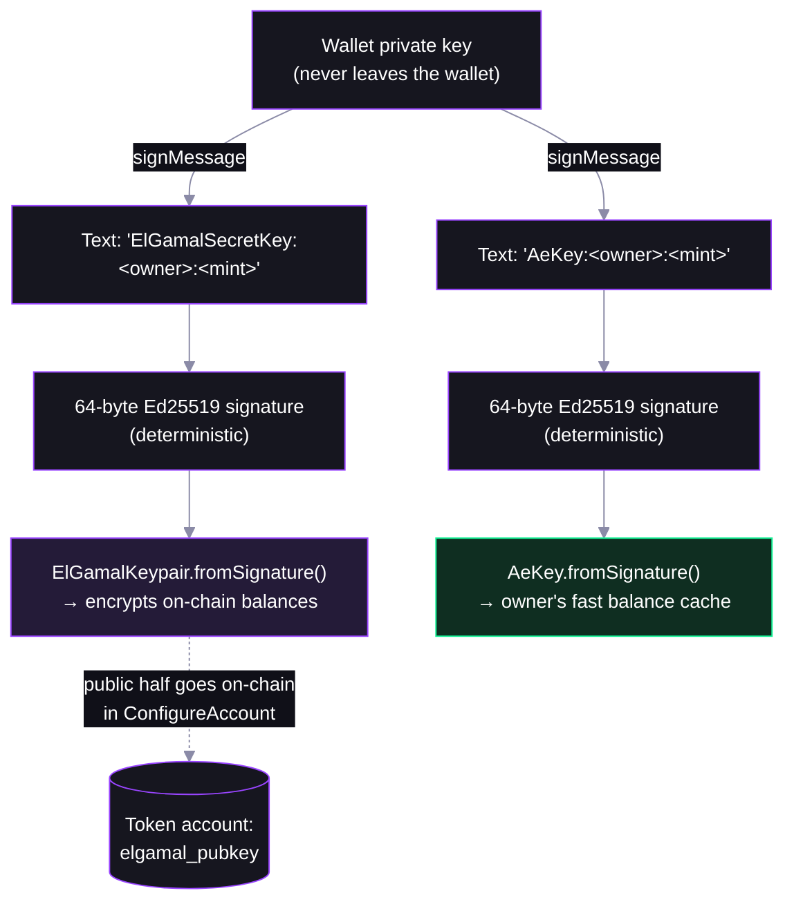
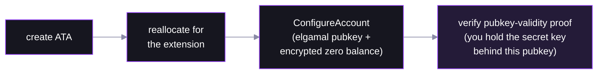

# Step 04 — Owners, Signature-Derived Keys, and Account Configuration

## Key derivation: signatures over readable text



## Configuration bundles a proof



## The helpers

- **`getCreateConfidentialTransferAccountInstructionPlan`** (`@solana-program/token-2022/confidential`) — one plan: ATA + reallocate + configure + pubkey-validity proof

  ```ts
  await getCreateConfidentialTransferAccountInstructionPlan({ payer, owner, mint, rpc, elgamalKeypair, aesKey })
  ```

- **`deriveElGamalKeypairForOwnerMint`** / **`deriveAeKeyForOwnerMint`** (`@solana-program/token-2022/confidential`) — official derivation, but signs a **raw-byte** message that Phantom refuses; use with keypair signers (scripts, backends)

  ```ts
  await deriveElGamalKeypairForOwnerMint({ signer, owner, mint })
  ```

- **`ElGamalKeypair.fromSignature`** / **`AeKey.fromSignature`** (`@solana/zk-sdk`) — browser-wallet-friendly: sign human-readable text, seed the keys from the signature

  ```ts
  ElGamalKeypair.fromSignature(await signText(`ElGamalSecretKey:${owner}:${mint}`))
  AeKey.fromSignature(await signText(`AeKey:${owner}:${mint}`))
  ```
