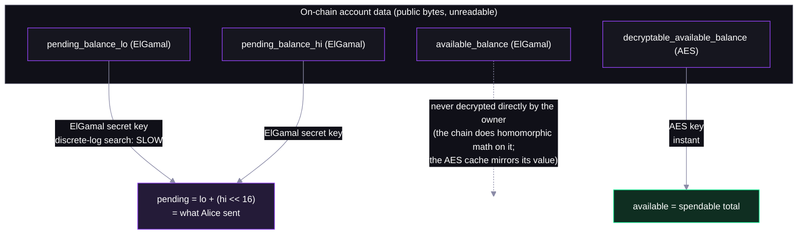
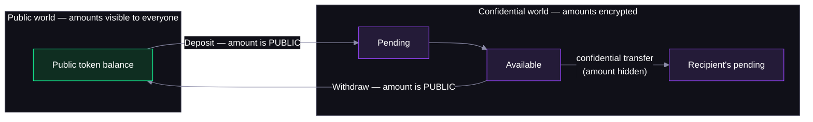

# Step 05 — Decrypting (and What Everyone Else Sees)


## Two decryption paths



## The helpers

No high-level helper — the one step that talks to `@solana/zk-sdk` directly:

- **`ElGamalCiphertext.fromBytes`** + **`ElGamalSecretKey.decrypt`** (`@solana/zk-sdk`) — pending, via bounded discrete-log search

  ```ts
  const lo = elgamalSecretKey.decrypt(ElGamalCiphertext.fromBytes(ct.pendingBalanceLow));
  const hi = elgamalSecretKey.decrypt(ElGamalCiphertext.fromBytes(ct.pendingBalanceHigh));
  const pending = lo + (hi << 16n);
  ```

- **`AeCiphertext.fromBytes`** + **`AeKey.decrypt`** (`@solana/zk-sdk`) — available, instant

  ```ts
  const available = aesKey.decrypt(AeCiphertext.fromBytes(ct.decryptableAvailableBalance));
  ```

## The public boundary


