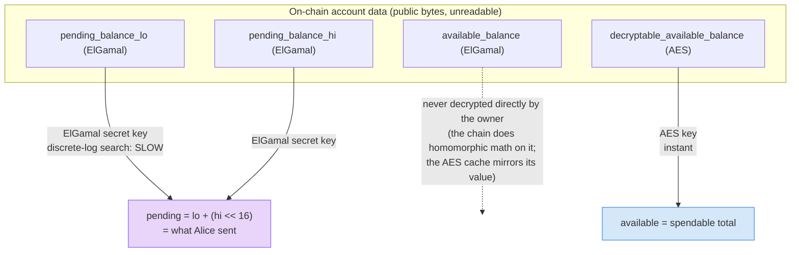

# Step 05 — Decrypting (and What Everyone Else Sees)

## In the app

Confidential balances in the [deployed app](https://confidential-transfers-explorer-web.vercel.app) show as **Click to decrypt**. Click, sign the two derivation messages from step 02, and the ciphertext resolves to a number — for you, and only you. Everyone else (the explorer UI, the RPC provider, every validator) keeps seeing opaque bytes. The production implementation is `deriveCtKeys` plus the decrypt helpers in [`apps/web/src/lib/confidentialTransfer.ts`](https://github.com/catmcgee/confidential-transfers-explorer/blob/main/apps/web/src/lib/confidentialTransfer.ts), wired up in [`apps/web/src/components/TransferModal.tsx`](https://github.com/catmcgee/confidential-transfers-explorer/blob/main/apps/web/src/components/TransferModal.tsx).

## What happens under the hood

The payoff. In the script below, Bob re-derives his keys by signing the same two text messages from step 02, decrypts his *pending* balance with his ElGamal secret key — and sees the exact amount Alice sent. He applies it to his *available* balance and reads his new spendable total instantly via his AES key. Before and after, the script prints the **raw base64 ciphertexts** from his account: that identical byte-noise is all the explorer, the RPC provider, and every validator will ever see. Same account, same bytes — the only difference is holding the key.


## Two decryption paths, on purpose

The account carries *two kinds* of ciphertext, decrypted with different keys at very different speeds:



- **Pending must be ElGamal** — that's the whole trick that lets senders *add* to it homomorphically without Bob's help. The price is slow decryption (a brute-force discrete-log search), which is why it's stored as 16-bit `lo` + 32-bit `hi` chunks.
- **Available gets an AES companion** — `decryptable_available_balance` is written only by the owner (during `ApplyPendingBalance`/transfers) and decrypts instantly to the full 64-bit value. It exists precisely so owners never need the slow ElGamal path for their own running balance. The ElGamal `available_balance` remains the source of truth the chain computes on and proofs bind to.

## The key code (from `05-decrypt.ts` / `helpers.ts`)

The code below is a minimal standalone version of exactly what the app's **Click to decrypt** does — you can run it against devnet:

```ts
// what an outsider sees — just bytes off the account
console.log(toBase64(ct.pendingBalanceLow));   // gl6KNHyU54NR1SGeS2pXIs5FrCw0...

// what Bob sees — ElGamal discrete-log on the lo/hi chunks
const lo = elgamalSecretKey.decrypt(ElGamalCiphertext.fromBytes(ct.pendingBalanceLow));
const hi = elgamalSecretKey.decrypt(ElGamalCiphertext.fromBytes(ct.pendingBalanceHigh));
const received = lo + (hi << 16n);             // = 123 tokens

// after applying: instant AES decryption of his own balance cache
const available = aesKey.decrypt(AeCiphertext.fromBytes(ct.decryptableAvailableBalance));
```

Run it:

```bash
NODE_OPTIONS=--experimental-wasm-modules npx tsx workshop/05-decrypt.ts
```

Look at the "outsider" block first (ciphertext), then the decrypted numbers right below. In the web app this is the "encrypted" badge everyone sees versus the unlocked balance after the wallet signs the two derivation messages.

## Protocol internals

These are the exact fields the script dumps and decrypts — [interface/src/extension/confidential_transfer/mod.rs](https://github.com/solana-program/token-2022/blob/main/interface/src/extension/confidential_transfer/mod.rs):

```rust
pub struct ConfidentialTransferAccount {
    ...
    /// The public key associated with ElGamal encryption
    pub elgamal_pubkey: PodElGamalPubkey,

    /// The low 16 bits of the pending balance (encrypted by `elgamal_pubkey`)
    pub pending_balance_lo: EncryptedBalance,

    /// The high 32 bits of the pending balance (encrypted by `elgamal_pubkey`)
    pub pending_balance_hi: EncryptedBalance,

    /// The available balance (encrypted by `encryption_pubkey`)
    pub available_balance: EncryptedBalance,

    /// The decryptable available balance
    pub decryptable_available_balance: DecryptableBalance,
    ...
}
```

And Bob's apply — [processor.rs](https://github.com/solana-program/token-2022/blob/main/program/src/extension/confidential_transfer/processor.rs), `process_apply_pending_balance` — is pure ciphertext arithmetic; the chain moves his money without ever learning the amount:

```rust
confidential_transfer_account.available_balance = ciphertext_arithmetic::add_with_lo_hi(
    &confidential_transfer_account.available_balance,
    &confidential_transfer_account.pending_balance_lo,
    &confidential_transfer_account.pending_balance_hi,
).ok_or(TokenError::CiphertextArithmeticFailed)?;
...
confidential_transfer_account.decryptable_available_balance =
    *new_decryptable_available_balance;   // only Bob could have produced this
```

## FAQ

**If the AES cache is only written by the owner, can a malicious owner lie in it?**
Only to themselves. The AES field is a convenience cache — every *proof* (and all on-chain arithmetic) runs against the ElGamal `available_balance`. Corrupting your own cache just breaks your own client until it re-derives the true value.

**How slow is 'slow' ElGamal decryption?**
Sub-second here: the chunks are ≤ 32 bits and the search uses a lookup table + baby-step giant-step. That's exactly why the protocol never stores amounts bigger than 48 bits in a single pending balance chunk pair.

**So what does the explorer actually show for these accounts?**
Exactly what this script printed in the outsider block: the extension exists, the pubkey is visible, and every balance field is opaque ciphertext — the deployed explorer renders that as "encrypted" unless *your* wallet signs the derivation messages.
