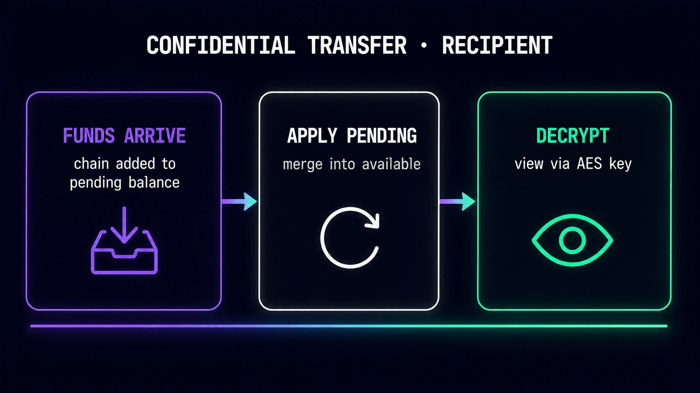
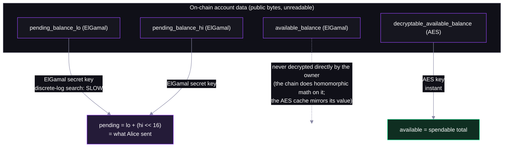
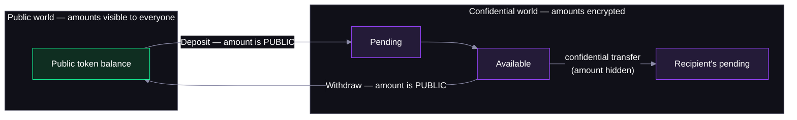

# Step 05 — Decrypting (and What Everyone Else Sees)

## In the app

Confidential balances in the [deployed app](https://confidential-transfers-explorer-web.vercel.app) show as **Click to decrypt**. Click, sign the two derivation messages from step 02, and the ciphertext resolves to a number — for you, and only you; everyone else keeps seeing opaque bytes. Production code: [`confidentialTransfer.ts`](https://github.com/catmcgee/confidential-transfers-explorer/blob/main/apps/web/src/lib/confidentialTransfer.ts) · [`TransferModal.tsx`](https://github.com/catmcgee/confidential-transfers-explorer/blob/main/apps/web/src/components/TransferModal.tsx).

## What happens under the hood

Bob re-derives his keys, decrypts his *pending* balance with his ElGamal secret key — the exact amount Alice sent — then applies it and reads his spendable total instantly via AES. Before and after, the script prints the **raw base64 ciphertexts**: that byte-noise is all the explorer, the RPC, and every validator ever see.



## Two decryption paths, on purpose

The account carries two kinds of ciphertext, decrypted with different keys at very different speeds:



- **Pending must be ElGamal** — that's what lets senders add to it homomorphically; the price is slow decryption, hence the lo/hi chunks.
- **Available gets an AES companion** — owner-written, instant to decrypt; the ElGamal `available_balance` stays the source of truth proofs bind to.

## The key code (from `05-decrypt.ts` / `helpers.ts`)

```ts
// what an outsider sees — just bytes off the account
console.log(toBase64(ct.pendingBalanceLow));   // gl6KNHyU54NR1SGeS2pXIs5FrCw0...

// what Bob sees — ElGamal discrete-log on the lo/hi chunks
const lo = elgamalSecretKey.decrypt(ElGamalCiphertext.fromBytes(ct.pendingBalanceLow));
const hi = elgamalSecretKey.decrypt(ElGamalCiphertext.fromBytes(ct.pendingBalanceHigh));
const received = lo + (hi << 16n);             // = 123 tokens

// after applying: instant AES decryption of his own balance cache
const available = aesKey.decrypt(AeCiphertext.fromBytes(ct.decryptableAvailableBalance));
```

Run it:

```bash
NODE_OPTIONS=--experimental-wasm-modules npx tsx workshop/05-decrypt.ts
```

The "outsider" block (ciphertext) versus the decrypted numbers below it is the app's "encrypted" badge versus the unlocked balance.

## Protocol internals

The exact fields the script dumps and decrypts — [interface/src/extension/confidential_transfer/mod.rs](https://github.com/solana-program/token-2022/blob/main/interface/src/extension/confidential_transfer/mod.rs):

```rust
pub struct ConfidentialTransferAccount {
    ...
    /// The public key associated with ElGamal encryption
    pub elgamal_pubkey: PodElGamalPubkey,

    /// The low 16 bits of the pending balance (encrypted by `elgamal_pubkey`)
    pub pending_balance_lo: EncryptedBalance,

    /// The high 32 bits of the pending balance (encrypted by `elgamal_pubkey`)
    pub pending_balance_hi: EncryptedBalance,

    /// The available balance (encrypted by `encryption_pubkey`)
    pub available_balance: EncryptedBalance,

    /// The decryptable available balance
    pub decryptable_available_balance: DecryptableBalance,
    ...
}
```

Bob's apply is pure ciphertext arithmetic — the chain moves his money without ever learning the amount: `process_apply_pending_balance` in [processor.rs](https://github.com/solana-program/token-2022/blob/main/program/src/extension/confidential_transfer/processor.rs) (walked through in step 03).

## The public boundary

Everything inside the confidential world stays encrypted — but the **crossings are public**. `Deposit` (step 03) and `Withdraw` both carry their amount as a plaintext instruction argument, so exiting reveals exactly what you exit with:



Observers can't see how value moved *inside*, but they see every entry and exit amount — so serious privacy usage keeps balances inside and crosses the boundary rarely.

## FAQ

**If the AES cache is only written by the owner, can a malicious owner lie in it?**
Only to themselves — proofs and on-chain arithmetic run against the ElGamal `available_balance`, so a corrupted cache just breaks your own client until it re-derives the true value.

**How slow is 'slow' ElGamal decryption?**
Sub-second here: chunks are ≤ 32 bits and the search uses a lookup table + baby-step giant-step. That's why single amounts are capped at 48 bits.

**So what does the explorer actually show for these accounts?**
Exactly the outsider block: the extension exists, the pubkey is visible, and every balance field is opaque ciphertext — rendered as "encrypted" unless *your* wallet signs the derivation messages.
